# Lösungen Processes

## Systemanalyse

### Befehle
```shell
`Ps -el`
`Htop`
`top`
```

### Installation
siehe [setup.sh](setup.sh)

### Threads pro Prozess
`htop` so konfigurieren, dass Thread pro Prozess angezeigt werden. Spalte `NLWP`.
Thread pro Prozess anzeigen:
`ps -T -p [PID]`

#### Cron Prozess
`top -b | grep restic`

## Scheduling

```mermaid
---
displayMode: compact
---

gantt
    title Scheduling
    dateFormat X
    axisFormat %s
    tickInterval 10second

section P1
    
    P1 ready: milestone, 0,0s
    P1 (40): P1, 0, 20s
    
    section P2
    P2 ready: milestone, 25, 0s
    P2 (30): P2, 30, 10s
    P2 (30): P2, 50, 10s
    P2 (30): P2, 90, 5s

    section P3
    P3 ready: milestone, 30, 0s
    P3 (30): P3, 40, 10s
    P3 (30): P3, 80, 10s
    P3 (30): P3, 100, 5s
    
    section P4
    P4 ready: milestone, 60, 0s
    P4 (35): P4, 60, 15s
    
    
    section P6
    P6 ready: milestone, 105, 0s
    P6 (10): P6, 110, 10s
    
    section p5
    P5 ready: milestone, 100, 0s
    P5 (5): P5, 120, 10s
    
    section idle
    Idle (0): P0, 20, 10s
```



CPU-Auslastung:
- Totale Zeit: `130s`
- Idle: `10s + 3*5s`
- Auslastung: `(130-10-3*5)/130=81%`

Wartezeit:

| Prozess | Wartezeit |
|---------|-----------|
| P1      | 0s        |
| P2      | 5s        |
| P3      | 10s       |
| P4      | 0s        |
| P5      | 20s       |
| P6      | 5s        |
