# Lösungen Processes

## Systemanalyse

### Befehle
```shell
`Ps -el`
`Htop`
`top`
```

### Installation
```shell
apt update

apt install postgresql postgresql-contrib apache2 ufw restic
systemctl start postgresql.service
systemctl enable apache2
systemctl start apache2

ufw allow OpenSSH
ufw allow 'Apache Full'
ufw enable

ufw status
```

## Scheduling

```mermaid
---
displayMode: compact
---

gantt
    title Scheduling
    dateFormat X
    axisFormat %s
    tickInterval 10second

section P1
    
    P1 ready: milestone, 0,0s
    P1 (40): P1, 0, 20s
    
    section P2
    P2 ready: milestone, 25, 0s
    P2 (30): P2, 30, 25s
    
    section P4
    P4 ready: milestone, 60, 0s
    P4 (35): P4, 60, 15s
    
    section P3
    P3 ready: milestone, 30, 0s
    P3 (30): P3, 80, 25s
    
    section P6
    P6 ready: milestone, 105, 0s
    P6 (10): P6, 110, 10s
    
    section p5
    P5 ready: milestone, 100, 0s
    P5 (5): P5, 120, 10s
    
    section idle
    Idle (0): P0, 20, 10s
```


