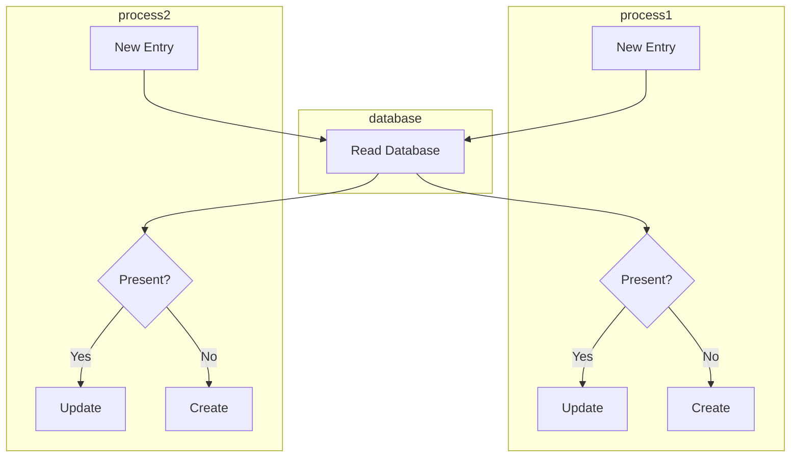

# Übung Koordination - Lösung

```mermaid
flowchart TD
    subgraph database 
        read_db
    end
    subgraph process1
        new_entry1[New Entry] --> read_db[Read Database]
        read_db[Read Database] --> present1{Present?}
        present1 --> |Yes| update1[Update]
        present1 --> |No| create1[Create]
    end
    subgraph process2
        new_entry2[New Entry] --> read_db[Read Database]
        read_db[Read Database] --> present2{Present?}
        present2 --> |Yes| update2[Update]
        present2 --> |No| create2[Create]
    end
```