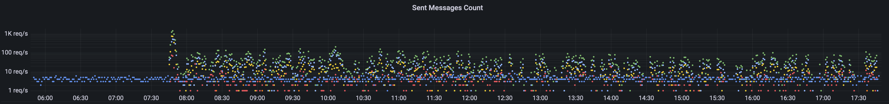

# Übung Koordination

Ein System "A" veröffentlicht bei jedem Datenbankzugriff die geänderten Daten in ein Publisher Subscriber System (
Message Broker).
Es werden bis zu 100 Nachrichten pro Sekunde veröffentlicht.
Die Nachrichten beziehen sich jeweils auf eine Entität, welche mit einer GUID identifiziert wird.

Das System "B" erhält von diesem Message Broker die Nachrichten und schreib diese in eine Datenbank.
In der Datenbank ist die GUID als primary Key definiert.
Beim Schreiben muss die Datenbank zuerst abgefragt werden, ob der Eintrag schon existiert und anschliessend der Eintrag
aktualisiert oder erstellt werden.

Der Message Broker wartet mit der Zustellung nicht, bis die vorherige Nachricht bestätigt wurde.
Das Empfangssystem verarbeitet die Nachrichten in mehreren Prozessen.

## Problemstellung

Es tauchen selten aber regelmässig «Duplicate Entry» Fehler auf.

- Was könnte die Ursache für diese Fehler sein? Skizziere mit einem Aktivitätsdiagramm.
  Verwende dazu PlantUML oder Mermaid.
- Wie könnte das Problem vermieden werden?