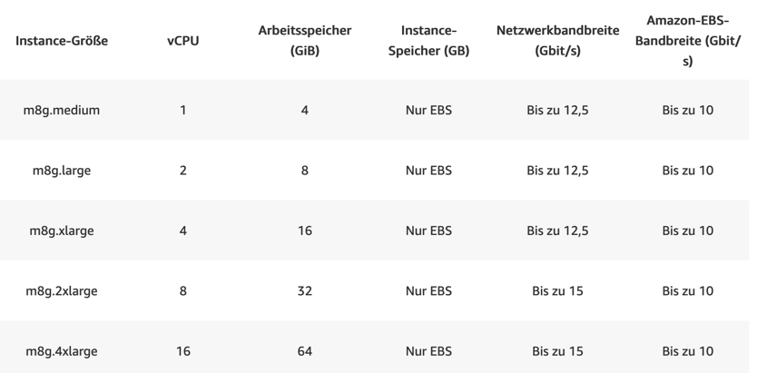

# Übung 1 Lösungen

## Auf welche Herausforderungen und Einschränkungen sind die Techniker:innen bei der Microservices-Architektur gestossen?

## Was sind die Vor- und Nachteile der beiden diskutierten Architekturen

## Untersuche in beiden Architekturen, welche Teile des Systems ein dezentrales System darstellen und welche ein verteiltes System.

## Virtualisierung

### EC2

Amazon Elastic Compute Cloud (EC2) war einer der ersten Services[^1], die AWS angeboten hat. EC2 stellt virtuelle
Maschinen (VM) zur Verfügung, die flexibel gestartet und gestoppt werden können und nur bei Gebrauch verrechnet
werden.[^2]
Durch diese Flexibilität ermöglicht EC2 die Entwicklung von Services, die auf ändernde Last reagieren (skalieren)
können. Da die VM Instanzen an zahlreichen AWS Standorten deployed werden können, können auch hohe Verfügbarkeit und
oder geringe Latenzen realisiert werden, da die Applikationen geographisch redundant und nahe bei den Usern deployed
werden können.[^3]
Es gibt viele verschiedene Instanztypen, z.B. für hohen Speicherbedarf oder hohen CPU-Bedarf.

Folgende Abbildung zeigt etwa unterschiedliche Instanztypen für allgemeine Zwekce mit AWS-Graviton CPUs.

Weiter gibt es etwa spezialisierte Instanzen für ML-Anwendungen:

[^1]: https://en.wikipedia.org/wiki/Timeline_of_Amazon_Web_Services

[^2]: https://docs.aws.amazon.com/AWSEC2/latest/UserGuide/concepts.html

[^3]: https://en.wikipedia.org/wiki/Amazon_Elastic_Compute_Cloud

### ECS

Amazon Elastic Container Service (Amazon ECS) ist ein vollständig durch AWS verwalteter Container Service. Mit ECS
können containerisierte Applikationen deployed werden.

ECS beinhaltet drei Ebenen, "Capacity", "Controller" und "Provisioning".

- Provisioning ist die Verwaltungsebene wo die Infrastruktur verwaltet und provisioniert wird. Die kann die AWS Api, Web
  Interface oder ein SDK sein.
- Controller ist die Kontrollebene. Hier werden die Instanzen der Applikation gesteuert und skaliert
- Capacity bezeichnet die Schicht, auf der die Container effektiv ausgeführt werden. Die kann [Amazon EC2]
  (https://docs.aws.amazon.com/ec2/), [AWS Fargate (Serverless)](https://aws.amazon.com/de/fargate/) oder On-Premise
  sein.

So kann die Applikation mit minimalem Verwaltungsaufwand (Serverless) deployed werden, oder auch On-Premise ausgeführt
werden, wenn dies z.B. aus Datenschutzgründen nötig ist. Der ECS Service wird mit einer Task-Definition konfiguriert,
welche beschreibt, welche Containerinstanzen für die Applikation ausgeführt werden sollen. Wenn die Applikation im
Container nicht mehr reagiert, wird automatisch eine neue Instanz gestartet.[^4]

Die Kosten sind abhängig von der gewählten Infrastruktur.[^5]
Bei EC2 fallen neben der EC2 Instanz keine zusätzlichen Kosten an. Bei Fargate werden CPU- und Arbeitsspeicherminuten
verrechnet. Bei On-Premise wird die gemietete Hardware verrechnet.

[^4]: https://docs.aws.amazon.com/AmazonECS/latest/developerguide/Welcome.html

[^5]: https://aws.amazon.com/de/ecs/pricing/