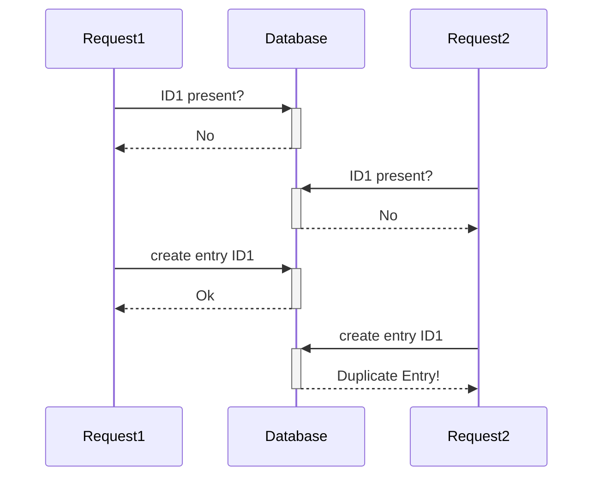

# Übung Koordination - Lösung

```mermaid
sequenceDiagram
    Request1->>+Database: ID1 present?
    Database-->>-Request1: No
    Request2->>+Database: ID1 present?
    Database-->>-Request2: No
    Request1->>+Database: create entry ID1
    Database-->>-Request1: Ok
    Request2->>+Database: create entry ID1
    Database-->>-Request2: Duplicate Entry!
```