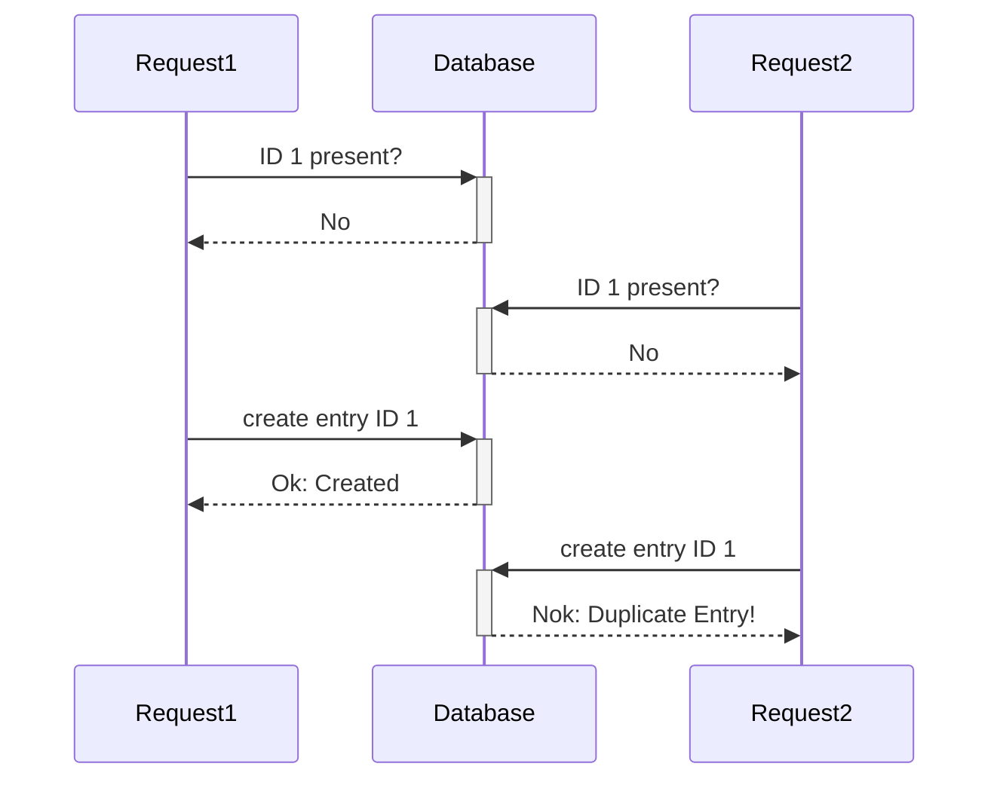

# Übung Koordination - Lösung

```mermaid
sequenceDiagram
    Request1->>+Database: ID 1 present?
    Database-->>-Request1: No
    Request2->>+Database: ID 1 present?
    Database-->>-Request2: No
    Request1->>+Database: create entry ID 1
    Database-->>-Request1: Ok: Created
    Request2->>+Database: create entry ID 1
    Database-->>-Request2: Nok: Duplicate Entry!
```