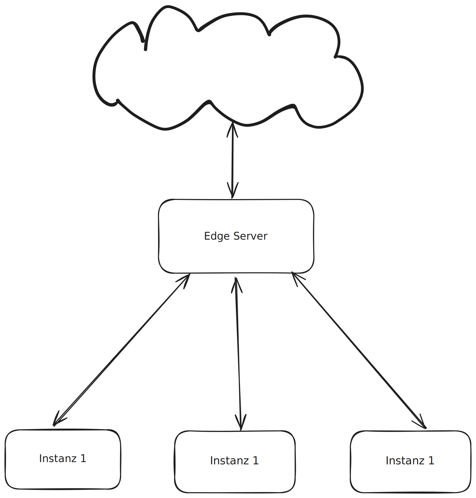

# Übung Edge Computing

## Lernziele

Die Studierenden

- kennen die Beweggründe und Herausforderungen von parallelen und verteilten Systemen
- kennen verschiedene dezentrale Architekturstile und deren Anwendung
- können ein einfaches verteiltes System entwerfen

## Dokumentation

Halte die Erkenntnisse und Designs in einem [Markdown-Dokument](https://www.markdownguide.org/)
mit [Mermaid](https://mermaid.js.org/) oder [PlantUML](https://plantuml.com/de/) fest.

## Ausgangslage

Eine Applikation publiziert, unter der Verwendung der
[Event Driven Architecture](https://en.wikipedia.org/wiki/Event-driven_architecture), bei jeder Änderung einen Event. Die Events werden via REST API in einem Backend persistiert und zur Synchronisation via Websockets an die anderen Instanzen gepusht. Ein Auszug aus dem resultierenden Event-Log befindet sich in [events.csv](events.csv).

Die Persistierung von einem einzelnen Event im Backend dauert im Mittel 200ms (Netzwerk Request und Verarbeitung). Das Backend wird nach Nutzung abgerechnet und skaliert auf 0.

Die maximale Datenübertragungsrate zum Backend beträgt 1Gbit/s.

## Aufgabenstellung

Da sich die Instanzen in der Regel im gleichen lokalen Netz befinden, soll untersucht werden, unter welchen Bedingungen ein Edge Server von Vorteil ist.

Der Edge Server hat folgende Aufgaben:

- Verteilen der Events an die lokalen Instanzen
- Batch basiertes Persistieren der Events im Backend

Die durch das Batching verursachte Verzögerung soll 2s nicht überschreiten.

Fragestellungen:

- Können mit der Edge-Architektur Cloud-Kosten gespart werden?
- Ist die Datenübertragungsrate relevant für diese Anwendung?
- Wie kann der Nutzen des Edge-Servers quantifiziert werden?
- Welchen Nutzen haben die beiden Architekturen für die Nutzer des Systems?

Formuliere geeignete **Hypothesen** und bestätige oder widerlege diese mit **stichhaltigen Berechnungen oder
Simulationen
**. Nutze für die Simulation den [Server](server.go) mit [Docker](Dockerfile). Die Fragestellungen können auch mit eigenen Fragen erweitert werden.
