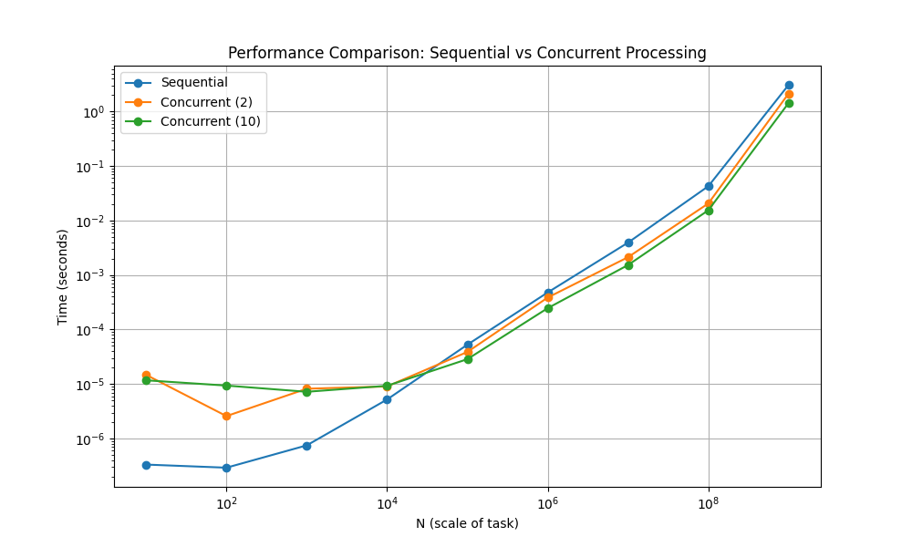
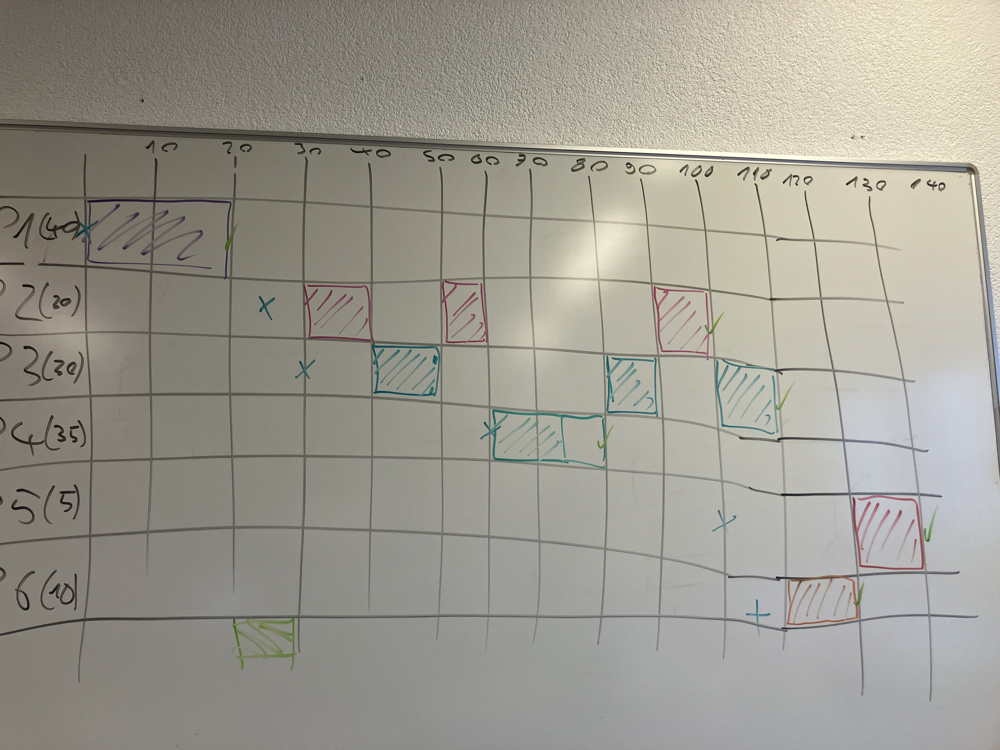

# Lösungen Processes

## Systemanalyse

### Befehle
```shell
`Ps -el`
`Htop`
`top`
```

### Installation
siehe [setup.sh](setup.sh)

### Threads pro Prozess
`htop` so konfigurieren, dass Thread pro Prozess angezeigt werden. Spalte `NLWP`.
Thread pro Prozess anzeigen:
`ps -T -p [PID]`

#### Cron Prozess
`top -b | grep restic`

## Multiprocessing



## Scheduling

