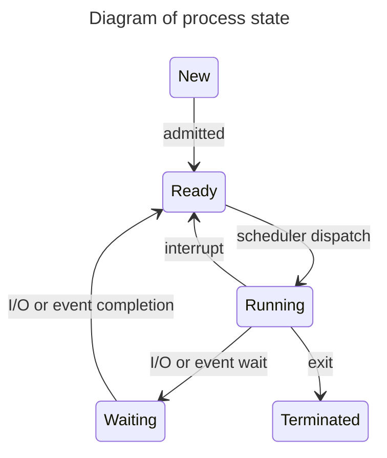

# Betriebssysteme

Die folgenden Texte sind Kapitel aus dem Buch "A.Silberschatz, P.B.Galvin, G.Gagne (2019): Operating System Concepts,
Wiley".
Für das Verständnis der Texte ist es wichtig, von diesem Buch eine Kopie zur Hand zu haben, da die Abbildungen in der
Übersetzung hier nicht vorhanden sind.

Die folgenden Texte wurden mit Chat GPT-4 übersetzt und auf vom Dozenten überprüft.

## 3 Prozesse

Frühe Computer erlaubten nur die Ausführung eines Programms zu einer Zeit. Dieses Programm hatte die vollständige
Kontrolle über das System und Zugriff auf alle Ressourcen des Systems. Im Gegensatz dazu erlauben aktuelle
Computersysteme, dass mehrere Programme gleichzeitig in den Speicher geladen und ausgeführt werden. Diese Entwicklung
erforderte eine bessere Kontrolle und mehr Abgrenzung der verschiedenen Programme; und diese Bedürfnisse führten zum
Konzept des Prozesses, welcher ein in Ausführung befindliches Programm ist. Ein Prozess ist die Arbeitseinheit in einem
modernen Computersystem.
Je komplexer das Betriebssystem ist, desto mehr Funktionalität wird erwartet. Obwohl seine
Hauptaufgabe die Ausführung von Benutzerprogrammen ist, muss es sich auch um verschiedene Systemaufgaben kümmern, die am
besten im user space und nicht innerhalb des Kernels erledigt werden. Ein System besteht daher aus einer Sammlung von
Prozessen, von denen einige Benutzercode ausführen und andere Betriebssystemcode. Potenziell können alle diese Prozesse
gleichzeitig ausgeführt werden, wobei die CPU (oder CPUs) unter ihnen gemultiplext wird. In diesem Kapitel werden Sie
erfahren, was Prozesse sind, wie sie in einem Betriebssystem dargestellt werden und wie sie funktionieren.

### 3.1 Prozesskonzept

Eine Frage, die sich bei der Diskussion über Betriebssysteme stellt, ist, wie man die verschiedenen CPU-Aktivitäten
bezeichnet. Frühe Computer waren Batch-Systeme, die Jobs ausführten, gefolgt von der Entstehung von
Time-Sharing-Systemen, die Benutzerprogramme oder Aufgaben ausführten. Selbst in einem Einbenutzersystem kann ein
Benutzer möglicherweise mehrere Programme gleichzeitig ausführen: eine Textverarbeitung, einen Webbrowser und ein
E-Mail-Programm. Und selbst wenn ein Computer nur ein Programm gleichzeitig ausführen kann, wie bei einem eingebetteten
Gerät, das Multitasking nicht
unterstützt, muss das Betriebssystem möglicherweise seine eigenen internen programmierten Aktivitäten unterstützen, wie
z.B. Speicherverwaltung. In vielerlei Hinsicht sind all diese Aktivitäten ähnlich, daher nennen wir sie alle Prozesse.

Obwohl wir persönlich den moderneren Begriff Prozess bevorzugen, hat der Begriff Job historische Bedeutung, da
viel von der Theorie und Terminologie der Betriebssysteme zu einer Zeit entwickelt wurde, als die Haupttätigkeit von
Betriebssystemen die Jobverarbeitung war. Daher verwenden wir in einigen angemessenen Fällen Job, wenn wir die Rolle des
Betriebssystems beschreiben. Zum Beispiel wäre es irreführend, die Verwendung von allgemein akzeptierten Begriffen zu
vermeiden, die das Wort Job enthalten (wie Jobplanung), nur weil Prozess Job überholt hat.

#### 3.1.1 Der Prozess

Informell, wie bereits erwähnt, ist ein Prozess ein in Ausführung befindliches Programm. Der Status der aktuellen
Aktivität eines Prozesses wird durch den Wert des Befehlszählers und den Inhalt der Register des Prozessors dargestellt.
Das Speicherlayout eines Prozesses ist typischerweise in mehrere Abschnitte unterteilt und wird in Abbildung 3.1
gezeigt. Diese Abschnitte umfassen:

- Text section - der ausführbare Code
- Data section - globale Variablen
- Heap section - Speicher, der während der Programmlaufzeit dynamisch zugewiesen wird
- Stack section - temporärer Datenspeicher beim Aufrufen von Funktionen (wie Funktionsparameter, Rückkehradressen und
  lokale Variablen)

Beachten Sie, dass die Grössen der Text- und Datensektionen fest sind, da sie sich während der Laufzeit des Programms
nicht ändern. Die Stack- und Heap-Sektionen hingegen können während der Programmausführung dynamisch schrumpfen und
wachsen. Jedes Mal, wenn eine Funktion aufgerufen wird, wird ein **activation record**, der Funktionsparameter, lokale
Variablen und die Rücksprungadresse enthält, auf den Stack gepusht; wenn die Kontrolle von der Funktion zurückgegeben
wird, wird der **activation record** vom Stack gepoppt. Ähnlich wächst der Heap, wenn Speicher dynamisch zugewiesen
wird, und schrumpft, wenn Speicher an das System zurückgegeben wird. Obwohl die Stack- und Heap-Sektionen aufeinander
zulaufen, muss das Betriebssystem sicherstellen, dass sie sich nicht überlappen.

Wir betonen, dass ein Programm an sich kein Prozess ist. Ein Programm ist eine passive Entität, wie eine Datei, die eine
Liste von Anweisungen enthält, die auf einer Festplatte gespeichert sind (oft als ausführbare Datei bezeichnet). Im
Gegensatz dazu ist ein Prozess eine aktive Entität mit einem program counter, der die nächste auszuführende Anweisung
angibt, und einem Satz zugehöriger Ressourcen. Ein Programm wird zu einem Prozess, wenn eine ausführbare Datei in den
Speicher geladen wird. Zwei gängige Techniken zum Laden ausführbarer Dateien sind das Doppelklicken auf ein Symbol, das
die ausführbare Datei darstellt, und das Eingeben des Namens der ausführbaren Datei in der Befehlszeile (wie bei
prog.exe oder a.out).

Obwohl zwei Prozesse mit demselben Programm verbunden sein können, werden sie dennoch als zwei separate
Ausführungssequenzen betrachtet. Beispielsweise können mehrere Benutzer unterschiedliche Kopien des Mail-Programms
ausführen, oder derselbe Benutzer kann viele Kopien des Webbrowser-Programms aufrufen. Jeder davon ist ein separater
Prozess; und obwohl die Textsektionen äquivalent sind, variieren die Daten-, Heap- und Stacksektionen. Es ist auch
üblich, dass ein Prozess viele Prozesse erzeugt, während er läuft. Solche Angelegenheiten besprechen wir in Abschnitt
3.4.

Beachten Sie, dass ein Prozess selbst eine Ausführungsumgebung für anderen Code sein kann. Die Java-Programmierumgebung
bietet ein gutes Beispiel. In den meisten Umständen wird ein ausführbares Java-Programm innerhalb der
Java-Virtual-Machine (JVM) ausgeführt. Die JVM wird als Prozess ausgeführt, der den geladenen Java-Code interpretiert
und Aktionen (über native Maschinenanweisungen) im Namen dieses Codes durchführt. Um beispielsweise das kompilierte
Java-Programm Program.class auszuführen, würden wir eingeben

```shell
java Program
```

Der Befehl `java` führt die JVM als gewöhnlichen Prozess aus, der wiederum das Java-Programm Program in der virtuellen
Maschine ausführt. Das Konzept ist dasselbe wie bei der Simulation, ausser dass der Code, anstatt für einen anderen
Befehlssatz geschrieben zu sein, in der Java-Sprache verfasst ist.

#### 3.1.2 Prozesszustand

Während ein Prozess ausgeführt wird, ändert er seinen Zustand. Der Zustand eines Prozesses wird teilweise durch die
aktuelle Aktivität dieses Prozesses definiert. Ein Prozess kann sich in einem der folgenden Zustände befinden:

- **New**. Der Prozess wird erstellt.
- **Running**. Anweisungen werden ausgeführt.
- **Waiting**. Der Prozess wartet auf das Eintreten eines Ereignisses (wie z. B. die Fertigstellung einer I/O-Operation
  oder
  den Empfang eines Signals).
- **Ready**. Der Prozess wartet darauf, einem Prozessor zugewiesen zu werden.
- **Terminated**. Der Prozess hat die Ausführung beendet.

Diese Namen sind willkürlich und variieren zwischen Betriebssystemen. Die Zustände, die sie repräsentieren, finden
sich jedoch in allen Systemen. Bestimmte Betriebssysteme unterteilen Prozesszustände auch feiner. Es ist wichtig zu
erkennen, dass zu jedem Zeitpunkt nur ein Prozess auf einem Prozessorkern ausgeführt werden kann. Viele Prozesse
können jedoch parat (ready) und wartend (waiting) sein. Das Zustandsdiagramm, das diesen Zuständen entspricht, ist
folgend:



#### 3.1.3 Process Control Block

Jeder Prozess wird im Betriebssystem durch einen **process control block (PCB)** repräsentiert - auch als Task Control
Block bezeichnet. Ein PCB wird in Abbildung 3.3 gezeigt. Er enthält viele Informationen, die mit einem spezifischen
Prozess verbunden sind, einschliesslich dieser:

- **Prozesszustand**. Der Zustand kann new, ready, waiting, running, terminated usw. sein.
- **Procram counter**. Der Zähler gibt die Adresse der nächsten auszuführenden Anweisung für diesen Prozess an.
- **CPU-Register**. Die Register variieren in Anzahl und Typ, je nach Computerarchitektur. Dazu gehören Akkumulatoren,
  Indexregister, Stackpointer und allgemeine Register sowie jegliche Zustandscode-Informationen. Zusammen mit dem
  program counter müssen diese Zustandsinformationen bei einer Unterbrechung gespeichert werden, um zu
  ermöglichen, dass der Prozess später korrekt fortgesetzt wird, wenn er erneut zur Ausführung geplant ist.
- **CPU-Scheduling-Informationen**. Diese Informationen umfassen eine Prozesspriorität, Zeiger auf
  Scheduling-Warteschlangen und alle anderen Scheduling-Parameter. (Kapitel 5 beschreibt das Process-Scheduling.)
- **Speicherverwaltungsinformationen**. Diese Informationen können Elemente wie den Wert der Basis- und
  Begrenzungsregister und die page table oder segment tables umfassen, abhängig von vom Betriebssystem verwendeten
  Speichersystem (Kapitel 9).
- **Abrechnungsinformationen**. Diese Informationen umfassen die Menge an CPU- und Echtzeitnutzung, Zeitlimits,
  Kontonummern, Job- oder Prozessnummern usw.
- **I/O-Statusinformationen**. Diese Informationen umfassen die Liste der dem Prozess zugewiesenen I/O-Geräte, eine
  Liste offener Dateien usw.

Kurz gesagt, dient der PCB einfach als Speicher für alle Daten, die benötigt werden, um einen Prozess zu starten
oder neu zu starten, zusammen mit einigen Abrechnungsdaten.

#### 3.1.4 Threads

Das bisher besprochene Prozessmodell hat impliziert, dass ein Prozess ein Programm ist, das eine einzelne
Ausführungslinie (Thread) durchführt. Zum Beispiel, wenn ein Prozess ein Textverarbeitungsprogramm ausführt, wird ein
einzelner Thread von Anweisungen ausgeführt. Dieser einzelne Kontroll-Thread ermöglicht es dem Prozess, nur eine Aufgabe
gleichzeitig auszuführen. Daher kann der Benutzer nicht gleichzeitig Zeichen eingeben und den Rechtschreibprüfer
ausführen. Die meisten modernen Betriebssysteme haben das Prozesskonzept erweitert, um einem Prozess zu erlauben,
mehrere Threads der Ausführung zu haben und somit mehr als eine Aufgabe gleichzeitig zu erledigen. Diese Funktion ist
besonders vorteilhaft auf Multicore-Systemen, wo mehrere Threads parallel laufen können. Ein multithreaded
Textverarbeitungsprogramm könnte zum Beispiel einem Thread die Verwaltung der Benutzereingabe zuweisen, während ein
anderer Thread den Rechtschreibprüfer ausführt. Auf Systemen, die Threads unterstützen, wird der PCB erweitert, um
Informationen für jeden Thread zu enthalten. Andere Änderungen im gesamten System sind ebenfalls erforderlich, um
Threads zu unterstützen. Kapitel 4 untersucht Threads im Detail.

### 3.2 Process Scheduling

Das Ziel der Multiprogrammierung ist es, zu jeder Zeit einen Prozess laufen zu lassen, um die CPU-Auslastung zu
maximieren. Das Ziel des Time-Sharing ist es, einen CPU-Kern so häufig zwischen Prozessen zu wechseln, dass Benutzer mit
jedem Programm interagieren können, während es läuft. Um diese Ziele zu erreichen, wählt der **process scheduler** einen
verfügbaren Prozess (möglicherweise aus einer Reihe von verfügbaren Prozessen) für die Programmausführung auf einem Kern
aus. Jeder CPU-Kern kann jeweils einen Prozess ausführen.

Bei einem System mit einem einzelnen CPU-Kern wird niemals mehr als ein Prozess gleichzeitig ausgeführt, während ein
Multicore-System gleichzeitig mehrere Prozesse ausführen kann. Wenn es mehr Prozesse als Kerne gibt, müssen
überschüssige Prozesse warten, bis ein Kern frei wird und neu geplant werden kann. Die Anzahl der Prozesse, die derzeit
im Speicher sind, wird als Grad der Multiprogrammierung bezeichnet.

Das Ausbalancieren der Ziele der Multiprogrammierung und des Time-Sharing erfordert auch die Berücksichtigung des
allgemeinen Verhaltens eines Prozesses. Im Allgemeinen können die meisten Prozesse als entweder I/O-gebunden oder
CPU-gebunden beschrieben werden. Ein I/O-gebundener Prozess ist einer, der mehr Zeit mit I/O verbringt als mit
Berechnungen. Ein CPU-gebundener Prozess erzeugt im Gegensatz dazu selten I/O-Anforderungen und verwendet mehr Zeit für
Berechnungen.

#### 3.2.1 Scheduling-Queues

Wenn Prozesse in das System eintreten, werden sie in eine **ready queue** eingereiht, in der sie bereit und
wartend sind, um auf einem CPU-Kern ausgeführt zu werden. Diese queue wird im Allgemeinen als verkettete Liste
gespeichert; ein ready queue header enthält Zeiger auf den ersten PCB in der Liste, und jeder PCB
enthält ein Zeigerfeld, das auf den nächsten PCB in der ready queue zeigt.

Das System umfasst auch andere queues. Wenn einem Prozess ein CPU-Kern zugewiesen wird, führt er eine Weile aus
und beendet schliesslich, wird unterbrochen oder wartet auf das Eintreten eines bestimmten Ereignisses, wie z.B. die
Fertigstellung einer I/O-Anfrage. Angenommen, der Prozess stellt eine I/O-Anfrage an ein Gerät wie eine Festplatte. Da
Geräte deutlich langsamer als Prozessoren laufen, muss der Prozess auf die Verfügbarkeit der I/O warten. Prozesse, die
auf das Eintreten eines bestimmten Ereignisses warten – wie die Fertigstellung von I/O – werden in eine wait queue
gestellt (Abbildung 3.4).

Eine gängige Darstellung der Prozessplanung ist ein queue diagram, wie das in Abbildung 3.5. Zwei Arten von
queues sind vorhanden: die ready queue und eine Reihe wait queues.
Die Kreise stellen die Ressourcen dar, die die queues bedienen, und die Pfeile zeigen den Fluss der Prozesse im
System an.

Ein neuer Prozess wird zunächst in die ready queue gelegt. Er wartet dort, bis er zur Ausführung
ausgewählt oder beauftragt wird. Sobald dem Prozess ein CPU-Kern zugewiesen wird und er ausgeführt wird, könnte eines
von mehreren Ereignissen eintreten:

- Der Prozess könnte eine I/O-Anfrage stellen und dann in eine I/O-queue gestellt werden.
- Der Prozess könnte einen neuen child process erstellen und dann in eine queue gestellt werden, während er auf
  die Beendigung des childs wartet.
- Der Prozess könnte vom scheduler vom Kern entfernt werden, als Ergebnis einer Unterbrechung oder weil sein Zeitschlitz
  abgelaufen ist, und wieder in die ready queue gestellt werden.

In den ersten beiden Fällen wechselt der Prozess schliesslich vom Wartezustand in den Bereitzustand und wird dann wieder
in die ready queue aufgenommen. Ein Prozess setzt diesen Zyklus fort, bis er beendet wird, woraufhin er aus
allen queues entfernt und sein PCB (Prozesskontrollblock) sowie seine Ressourcen freigegeben werden.

### 3.2.2 CPU-Scheduling

Ein Prozess wandert während seiner Lebensdauer zwischen der ready queue und verschiedenen wait queues. Die
Aufgabe des CPU-Schedulers besteht darin, aus den Prozessen in der ready queue auszuwählen und einem von ihnen
einen CPU-Kern zuzuweisen. Der CPU-Scheduler muss häufig einen neuen Prozess für die CPU auswählen. Ein I/O-gebundener
Prozess kann nur wenige Millisekunden ausgeführt werden, bevor er auf eine I/O-Anforderung wartet. Obwohl ein
CPU-gebundener Prozess längere Zeit einen CPU-Kern benötigt, ist es unwahrscheinlich, dass der Scheduler den Kern für
einen längeren Zeitraum einem Prozess gewährt. Stattdessen wird er wahrscheinlich gezwungen sein, den CPU von einem
Prozess zu entfernen und einen anderen Prozess zur Ausführung zu planen. Daher wird der CPU-Scheduler mindestens einmal
alle 100 Millisekunden ausgeführt, typischerweise viel häufiger.

Einige Betriebssysteme haben eine Zwischenform des Schedulings, bekannt als Swapping, dessen Schlüsselidee darin
besteht, dass es manchmal vorteilhaft sein kann, einen Prozess aus dem Speicher zu entfernen (und somit aus der aktiven
Konkurrenz um die CPU) und so den Grad der Multiprogrammierung zu reduzieren. Später kann der Prozess wieder in den
Speicher eingeführt und seine Ausführung dort fortgesetzt werden, wo sie unterbrochen wurde. Dieses Schema wird als
Swapping bezeichnet, da ein Prozess aus dem Speicher auf die Festplatte "ausgelagert" werden kann, wo sein aktueller
Status gespeichert wird, und später von der Festplatte zurück in den Speicher "eingelagert" wird, wo sein Status
wiederhergestellt wird. Swapping ist typischerweise nur notwendig, wenn der Speicher überbelegt wurde und freigegeben
werden muss. Swapping wird in Kapitel 9 diskutiert.

### 3.2.3 Kontextwechsel

Wie in Abschnitt 1.2.1 erwähnt, veranlassen Unterbrechungen das Betriebssystem dazu, einen CPU-Kern von seiner aktuellen
Aufgabe zu wechseln und eine Kernel-Routine auszuführen. Solche Vorgänge geschehen häufig in Allzwecksystemen. Wenn eine
Unterbrechung auftritt, muss das System den aktuellen Kontext des auf dem CPU-Kern laufenden Prozesses speichern, damit
es diesen Kontext wiederherstellen kann, wenn seine Verarbeitung abgeschlossen ist. Dies bedeutet im Wesentlichen, den
Prozess zu unterbrechen und später fortzusetzen. Der Kontext wird im PCB des Prozesses dargestellt. Er umfasst den Wert
der CPU-Register, den Prozesszustand (siehe Abbildung 3.2) und Informationen zur Speicherverwaltung. Generell führen wir
eine Zustandsspeicherung des aktuellen Zustands des CPU-Kerns durch, sei es im Kernel- oder Benutzermodus, und dann eine
Zustandswiederherstellung zur Wiederaufnahme des Betriebs.

Das Umschalten des CPU-Kerns auf einen anderen Prozess erfordert eine Zustandsspeicherung des aktuellen Prozesses und
eine Zustandswiederherstellung eines anderen Prozesses. Diese Aufgabe wird als Kontextwechsel bezeichnet und ist in
Abbildung 3.6 dargestellt. Wenn ein Kontextwechsel stattfindet, speichert der Kernel den Kontext des alten Prozesses in
seinem PCB und lädt den gespeicherten Kontext des neu geplanten Prozesses. Die Zeit für den Kontextwechsel ist reiner
Overhead, da das System während des Wechsels keine nützliche Arbeit leistet. Die Geschwindigkeit des Wechsels variiert
von Maschine zu Maschine, abhängig von der Speichergeschwindigkeit, der Anzahl der zu kopierenden Register und dem
Vorhandensein spezieller Anweisungen (wie einer einzelnen Anweisung zum Laden oder Speichern aller Register). Eine
typische Geschwindigkeit beträgt mehrere Mikrosekunden.

Die Zeiten für Kontextwechsel hängen stark von der Hardwareunterstützung ab. Zum Beispiel bieten einige Prozessoren
mehrere Registersätze. Ein Kontextwechsel erfordert hier lediglich das Ändern des Zeigers auf den aktuellen
Registersatz. Natürlich, wenn es mehr aktive Prozesse als Registersätze gibt, greift das System, wie zuvor, auf das
Kopieren von Registerdaten in und aus dem Speicher zurück. Ausserdem gilt: Je komplexer das Betriebssystem, desto
grösser ist der Arbeitsaufwand, der während eines Kontextwechsels geleistet werden muss. Wie wir in Kapitel 9 sehen
werden, können fortgeschrittene Speicherverwaltungstechniken erfordern, dass zusätzliche Daten bei jedem Kontextwechsel
gewechselt werden. Zum Beispiel muss der Adressraum des aktuellen Prozesses erhalten bleiben, während der Raum der
nächsten Aufgabe für die Nutzung vorbereitet wird. Wie der Adressraum erhalten bleibt und welcher Arbeitsaufwand dafür
notwendig ist, hängt von der Speicherverwaltungsmethode des Betriebssystems ab.
