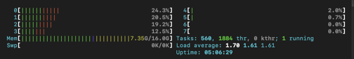
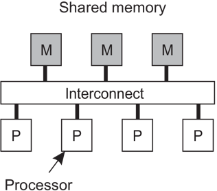
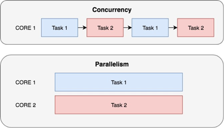
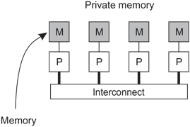
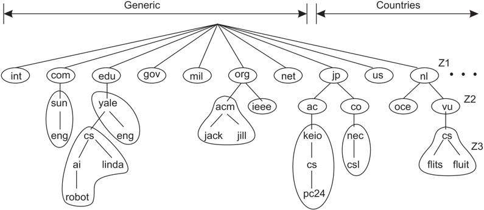
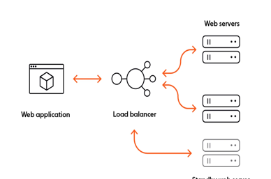
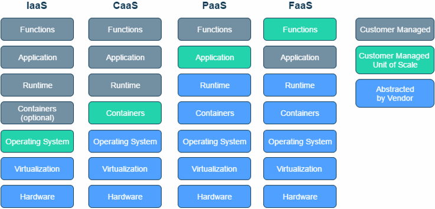

<!-- headingDivider: 3 -->
# Parallele und verteilte Systeme
## Einführung
### «Parallele Systeme»
- Eine single core CPU kann nur einen Prozess gleichzeitig ausführen
- Multi-core CPUs entsprechend mehrere gleichzeitig
- Ausser in sehr einfachen Embedded Systemen müssen jedoch immer sehr viele Prozesse «gleichzeitig» ausgeführt werden können z.B. auf einem Server oder auf einem Desktop Computer

### «Parallele Systeme»- 

- Viele verschiedene Prozesse (tausende) werden von einem oder mehreren (bis zu dutzenden) Prozessoren ausgeführt
- Ein einzelner Prozessor kann demnach nacheinander mehrere Prozesse bearbeiten
- Die Prozessoren befinden sich auf demselben Chip oder auf dem selben Mainboard
- Sie haben geteilten sowie gemeinsamen Speicher
- Die Verbindung zwischen ihnen (Interconnect) hat geringe Latenz, hohe Bandbreite und ist zuverlässig.

---

- Parallele Ausführung (parallelism): Mehr als eine Aufgabe wird gleichzeitig ausgeführt
- Nebenläufig (concurrency): Mehr als eine Aufgabe wird abgearbeitet (durch schnelles context switching)

---

- Eine zentrale Aufgabe von Betriebsystemen ist es, die Prozesse auf die CPUs zu verteilen.
- Dies wird «Scheduling» genannt.

### Verteilte Systeme

> «A distributed system is a collection of independent computers that appears to its users as a single coherent system.»

VanSteen, 2017, S. 26

P: Prozessor,
Interconnect: Netzwerkverbindung, meistens HTTP, UDP/TCP, IP, Ethernet basiert

---

- Ressourcen verfügbar machen: Drucker, Computing, Storage, Daten, Netzwerk
- Teure Ressourcen können besser ausgelastet werden und müssen nicht mehrfach angeschafft werden
- Zusammenarbeit

### Domain Name System

### Anforderungen an moderne Software

- Hohe Verfügbarkeit
- Skalierbarkeit
- Im Katastrophenfall sollen die Systeme schnell wiederhergestellt werden können
- Soll funktionieren, auch wenn Teile des Systems Offline sind (Resilienz)
- Kostengünstig
- Einfach
- Updates müssen einfach eingespielt werden können

### Skalierung
#### Vertikal
- Existierende Infrastruktur wird aufgerüstet
- Einfach
- Limitiert

#### Horizontal
- Hinzufügen von neuer Infrastruktur
- Aufwendig: Anwendungen müssen verteilt werden
- Kaum limitiert

### Lösungsansätze

- Verfügbarkeit, Skalierbarkeit: Mehre identische Systeme müssen verfügbar sein. 
- Bei Bedarf sollen weitere schnell gestartet werden können

### Cloud Computing
> The entire history of software engineering is that of the rise in levels of abstraction.

-- Grady Booch

### Pizza as a Service

### Abstractions

(VanSteen, 2017, S. 30)

### XaaS

### Fallstudie

