<!-- headingDivider: 4 -->
<style>
img {
  display: block;
  margin: 0 auto;
}
</style>

# Einführung

[This work is published under a Creative Commons BY-SA license.](https://creativecommons.org/licenses/by-sa/4.0/)

## «Parallele Systeme»

- Eine single core CPU kann nur einen Prozess gleichzeitig ausführen
- Multi-core CPUs entsprechend mehrere gleichzeitig
- Ausser in sehr einfachen Embedded Systemen müssen jedoch immer sehr viele Prozesse «gleichzeitig» ausgeführt werden
  können z.B. auf einem Server oder auf einem Desktop Computer
  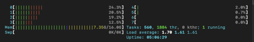

## «Parallele Systeme»

- Viele verschiedene Prozesse (tausende) werden von einem oder mehreren (bis zu dutzenden) Prozessoren ausgeführt
- Ein einzelner Prozessor kann demnach nacheinander mehrere Prozesse bearbeiten
- Die Prozessoren befinden sich auf demselben Chip oder auf dem selben Mainboard
- Sie haben geteilten sowie gemeinsamen Speicher
- Die Verbindung zwischen ihnen (Interconnect) hat geringe Latenz, hohe Bandbreite und ist zuverlässig.
  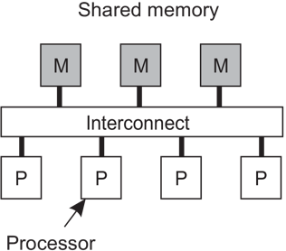

---

- Parallele Ausführung (parallelism): Mehr als eine Aufgabe wird gleichzeitig ausgeführt
- Nebenläufig (concurrency): Mehr als eine Aufgabe wird abgearbeitet (durch schnelles context switching)
  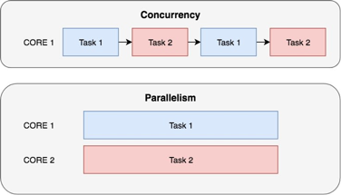

---

- Eine zentrale Aufgabe von Betriebsystemen ist es, die Prozesse auf die CPUs zu verteilen.
- Dies wird «Scheduling» genannt.

## Verteilte Systeme

> «A distributed system is a collection of independent computers that appears to its users as a single coherent system.»

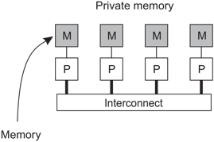
VanSteen, 2017, S. 26

P: Prozessor, Interconnect: Netzwerkverbindung, meistens HTTP, UDP/TCP, IP, Ethernet basiert

# Resource Sharing

- Ressourcen verfügbar machen: Drucker, Computing, Storage, Daten, Netzwerk
- Teure Ressourcen können besser ausgelastet werden und müssen nicht mehrfach angeschafft werden
- Zusammenarbeit

## Domain Name System

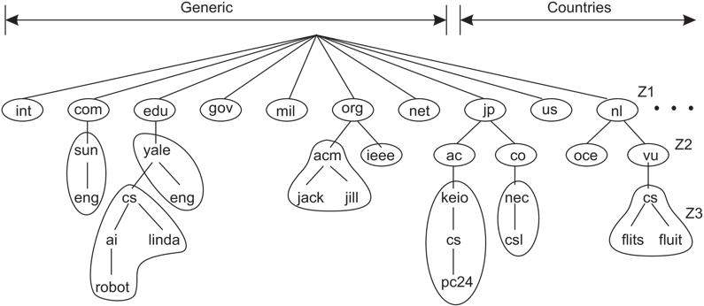

---


## Anforderungen an moderne Software

- Hohe Verfügbarkeit
- Skalierbarkeit
- Im Katastrophenfall sollen die Systeme schnell wiederhergestellt werden können
- Soll funktionieren, auch wenn Teile des Systems Offline sind (Resilienz)
- Kostengünstig
- Einfach
- Updates müssen einfach eingespielt werden können

## Lösungsansätze

- Replication: Masking Failures
- Tradeoff: Teuer und Komplex

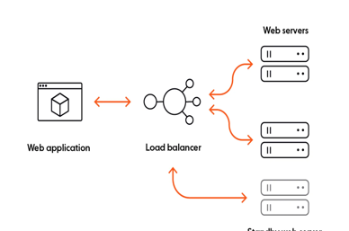

## Populäre verteilte Systeme

- [Matrix](https://element.io/features/decentralised-matrix-network)
- [Mastodon](https://joinmastodon.org/)
- [Nextcloud](https://nextcloud.com/de/)
- [CockroachDB](https://www.cockroachlabs.com/product/)
- [Neon](https://neon.tech/)
- [Ably](https://ably.com/)
- ...

# Koordination

- Tasks können gleichzeitig ausgeführt werden
- Gleichzeitiger Zugriff auf gemeinsame Daten kann in inkonsistenten Daten resultieren

## Mutex

- MUTual EXclusion: wechselseitiger Ausschluss
- Einfachste Möglichkeit, Ressourcen für alle anderen zu blockieren
- Critical Section wird mit acquire() und release() umschlossen
- acquire() und release() müssen atomare Operationen sein (Hardwareunterstützung)

### Mutex

```C
acquire() { 
  while (!available)
    /* busy wait */
  available = false;;
}

release() {
  available = true;
}
```

```C
do {
    acquire lock
       critical section
    release lock
      remainder section
 } while (true);
```

## Semaphore

- Mehr Möglichkeiten als Mutex
- Schützt gemeinsame Ressourcen
- Counting semaphore: Mehrere Ressourcen
- Binary semaphore: Nur eine Ressource
- Ein Zugriff auf eine gemeinsame Ressource wird mit dem Nehmen und Geben umschlossen

### Beispiel

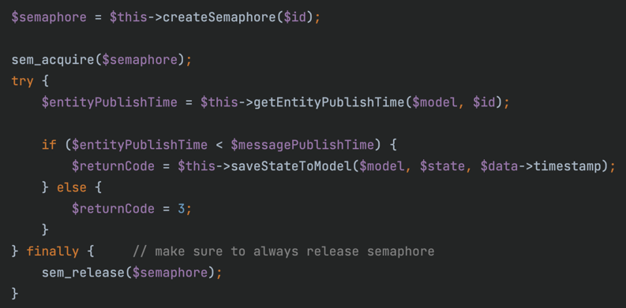

# Time, clocks, and ordering of events

The following slides adapted of Martin Kleppmann's Course at University of Cambridge:
https://www.cl.cam.ac.uk/teaching/2425/ConcDisSys/materials.html

## Clocks and time in distributed systems

Distributed systems often need to measure time, e.g.:

- Schedulers, timeouts, failure detectors, retry timers
- Performance measurements, statistics, profiling
- Log files & databases: record when an event occurred 
- Data with time-limited validity (e.g. cache entries)
- Determining order of events across several nodes

## Quartz clock error: drift

- One clock runs slightly fast, another slightly slow
- Drift measured in parts per million (ppm)
- 1 ppm = 1 microsecond/second = 86 ms/day = 32 s/year 
- Most computer clocks correct within ≈ 50 ppm

## Atomic clocks

- Caesium-133 has a resonance
- Tune an electronic oscillator to that resonant frequency
- Accuracy ≈ 1 in 10−14 (1 second in 3 million years)

## GPS as time source

- 31 satellites, each carrying an atomic clock
- satellite broadcasts current time and location
- calculate position from speed-of-light delay between satellite and receiver

## Coordinated Universal Time (UTC)

Greenwich Mean Time (GMT, solar time): it’s noon when the sun is in the south, as seen from the Greenwich meridian

Synonym to GMT: Coordinated Universal Time (UTC)

International Atomic Time (TAI): 1 day is 24 × 60 × 60 × 9,192,631,770 periods of caesium-133’s resonant frequency

Problem: speed of Earth’s rotation is not constant

Compromise: UTC is TAI with corrections to account for Earth rotation

Time zones and daylight savings time are offsets to UTC

## How computers represent timestamps

Two most common representations:

- Unix time: number of seconds since 1 January 1970 00:00:00 UTC (the “epoch”), not counting leap seconds
- ISO 8601: year, month, day, hour, minute, second, and timezone offset relative to UTC example:
  `2021-11-09T09:50:17+00:00`

## Clock synchronisation

Computers track physical time/UTC with a quartz clock (with battery, continues running when power is off)

Due to clock drift, clock error gradually increases

Clock skew: difference between two clocks at a point in time

Solution: Periodically get the current time from a server that has a more accurate time source (atomic clock or GPS
receiver)

Protocols: Network Time Protocol (NTP), Precision Time Protocol (PTP)

## Ordering of messages

When using Timestamps to order events, order can be inconsistent with expected order!

- Clocks might not be synced
- One message might overtake another message in transit

## Causality

Taken from physics (relativity).

- When $a → b$, then a might have caused b.
- When $a || b$, we know that a cannot have caused b.

Happens-before relation encodes potential causality.

## Logical vs. physical clocks

- Physical clock: count number of seconds elapsed
- Logical clock: count number of events occurred

Physical timestamps: useful for many things, but may be inconsistent with causality.

Logical clocks: designed to capture causal dependencies.

$(e1 → e2) ⇒ (T(e1) < T(e2)$

- Lamport clocks
- Vector clocks

## Lamport clocks in words
- Each node maintains a counter t, incremented on every local event e
- Attach current t to messages sent over network
- Recipient moves its clock forward to timestamp in the message (if greater than local counter), then increments

Properties of this scheme:

- If $a→b$ then $L(a)<L(b)$ (Let L(e) be the value of t after that increment)
- However, $L(a) < L(b)$ does not imply $a → b$

# Replication

- Keeping a copy of the same data on multiple nodes: Databases, filesystems, caches, ...
- A node that has a copy of the data is called a replica
- If some replicas are faulty, others are still accessible
- Spread load across many replicas
- Easy if the data doesn’t change: just copy it
- We will focus on data changes

## Idempotence

A function f is idempotent if f(x) = f(f(x)).

Choice of retry behaviour:

- **At-most-once semantics:** send request, don’t retry, update may not happen
- **At-least-once semantics:** retry request until acknowledged, may repeat update
- **Exactly-once semantics:** retry + idempotence or deduplication

## "Consistency"

A word that means many different things in different contexts!

- **ACID**: a transaction transforms the database from one “consistent” state to another
    - Here, “consistent” = satisfying application-specific invariants e.g. “every course with students enrolled must
      have at least one lecturer”
- **Read-after-write consistency**
- **Replication**: replica should be “consistent” with other replicas
    - “consistent” = in the same state? (when exactly?)
    - “consistent” = read operations return same result?
- Consistency model: many to choose from

---

Recall atomicity in the context of ACID transactions:

- A transaction either commits or aborts
- If it commits, its updates are durable
- If it aborts, it has no visible side-effects
- ACID consistency (preserving invariants) relies on atomicity

## Strong Consistency: Linearizability

- Informally: every operation takes effect atomically sometime after it started and before it finished
- All operations behave as if executed on a single copy of the data (even if there are in fact multiple replicas)
- Consequence: every operation returns an “up-to-date” value, a.k.a. “strong consistency”

Linearizability advantages:

- Makes a distributed system behave as if it were non-distributed
- Simple for applications to use

Downsides:

- Performance cost: lots of messages and waiting for responses
- Scalability limits: leader can be a bottleneck
- Availability problems: if you can’t contact a quorum of nodes, you can’t process any operations

## Eventual Consistency

- Eventual consistency: a weaker model than linearizability. Different trade-off choices.
- Replicas process operations based only on their local state.
- If there are no more updates, eventually all replicas will be in the same state.
- No guarantees how long it might take

## Local-first software

End-user device is a full replica; servers are just for backup. “Local-first”: a term introduced by me (Martin
Kleppmann) and my colleagues https://www.inkandswitch.com/local-first/

Calendar app with cross-device sync as an example:

- App works offline (can both read and modify data)
- Fast: no need to wait for network round-trip
- Sync with other devices when online
- Real-time collaboration with other users
- Longevity: even if cloud service shuts down, you have a copy of your files on your own computer
- Supports end-to-end encryption for better security
- Simpler programming model than RPC
- User control and agency over their own data

# Publish-subscribe Architekturen

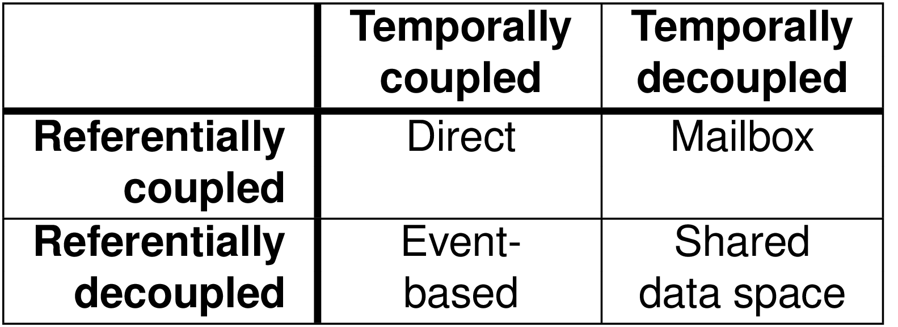

---

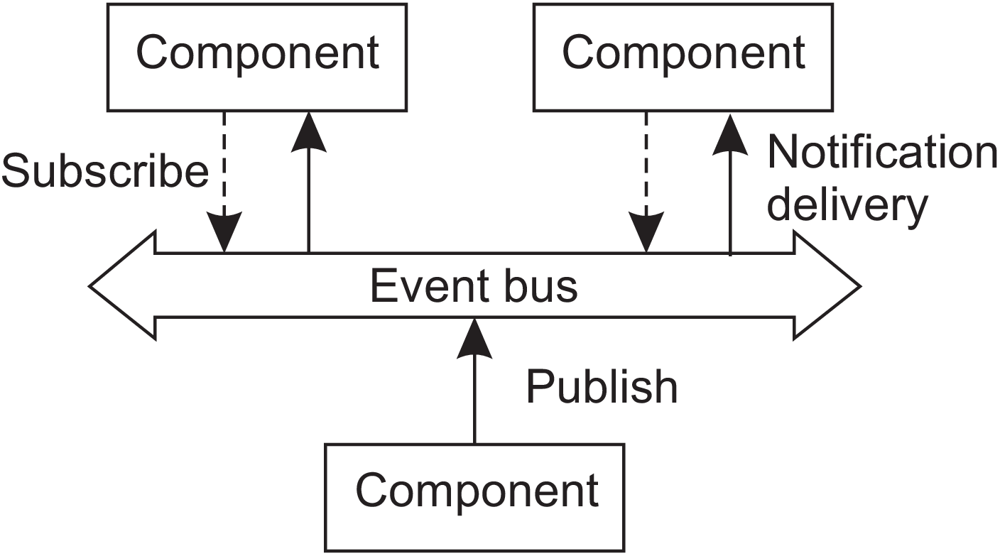

---

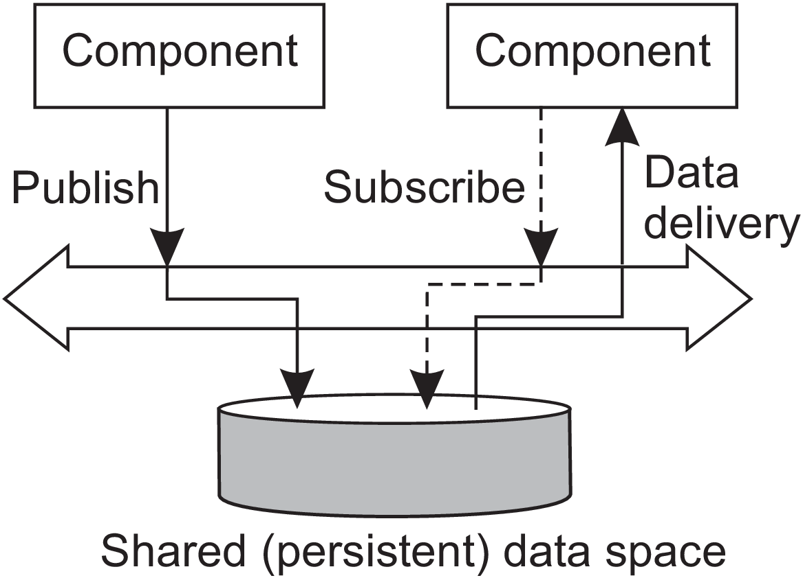

---

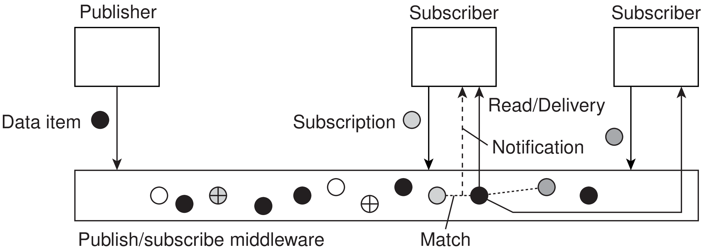

---

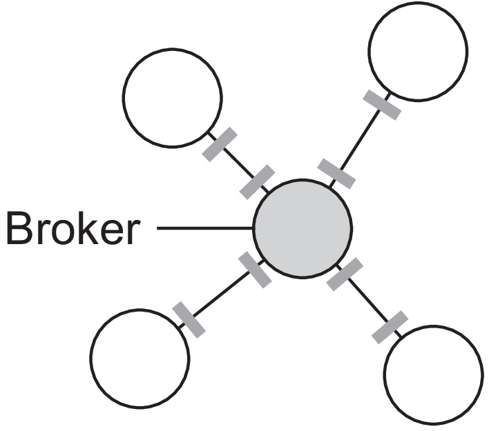

---

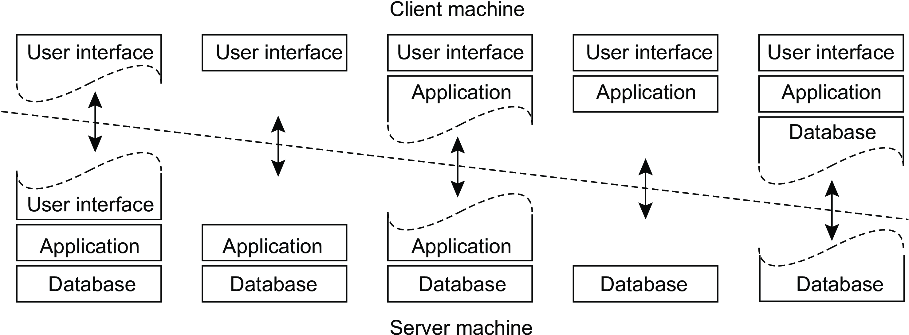

# Cloud und Edge Computing

> The entire history of software engineering is that of the rise in levels of abstraction.

-- Grady Booch

---

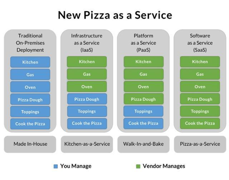

## Abstractions

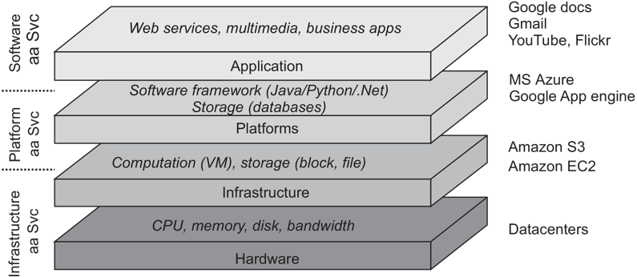
(VanSteen, 2017, S. 30)

## XaaS


## Fallstudie

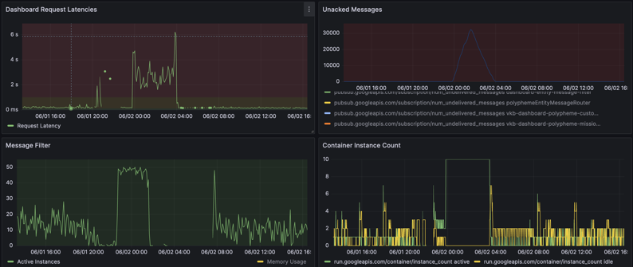

## Edge Computing

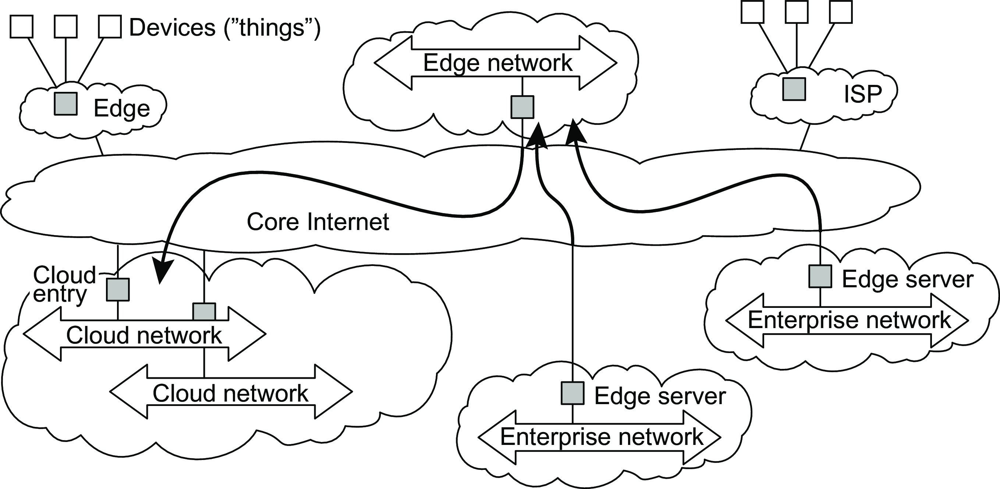
