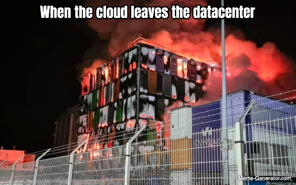
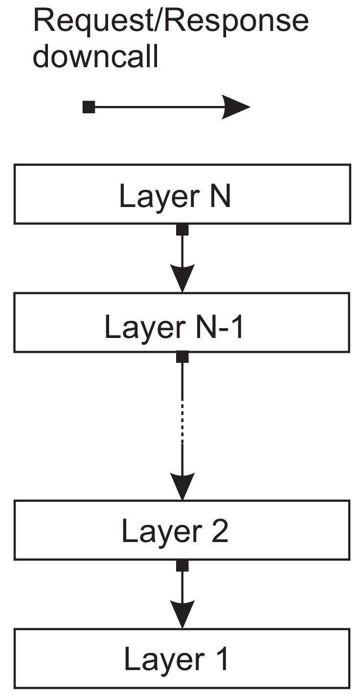

<!-- headingDivider: 4 -->

# Einführung

## «Parallele Systeme»

- Eine single core CPU kann nur einen Prozess gleichzeitig ausführen
- Multi-core CPUs entsprechend mehrere gleichzeitig
- Ausser in sehr einfachen Embedded Systemen müssen jedoch immer sehr viele Prozesse «gleichzeitig» ausgeführt werden
  können z.B. auf einem Server oder auf einem Desktop Computer
  

## «Parallele Systeme»

- Viele verschiedene Prozesse (tausende) werden von einem oder mehreren (bis zu dutzenden) Prozessoren ausgeführt
- Ein einzelner Prozessor kann demnach nacheinander mehrere Prozesse bearbeiten
- Die Prozessoren befinden sich auf demselben Chip oder auf dem selben Mainboard
- Sie haben geteilten sowie gemeinsamen Speicher
- Die Verbindung zwischen ihnen (Interconnect) hat geringe Latenz, hohe Bandbreite und ist zuverlässig.
  

---

- Parallele Ausführung (parallelism): Mehr als eine Aufgabe wird gleichzeitig ausgeführt
- Nebenläufig (concurrency): Mehr als eine Aufgabe wird abgearbeitet (durch schnelles context switching)
  

---

- Eine zentrale Aufgabe von Betriebsystemen ist es, die Prozesse auf die CPUs zu verteilen.
- Dies wird «Scheduling» genannt.

### Verteilte Systeme

> «A distributed system is a collection of independent computers that appears to its users as a single coherent system.»

VanSteen, 2017, S. 26

P: Prozessor, Interconnect: Netzwerkverbindung, meistens HTTP, UDP/TCP, IP, Ethernet basiert

## Resource Sharing

- Ressourcen verfügbar machen: Drucker, Computing, Storage, Daten, Netzwerk
- Teure Ressourcen können besser ausgelastet werden und müssen nicht mehrfach angeschafft werden
- Zusammenarbeit

### Domain Name System

---

### Anforderungen an moderne Software

- Hohe Verfügbarkeit
- Skalierbarkeit
- Im Katastrophenfall sollen die Systeme schnell wiederhergestellt werden können
- Soll funktionieren, auch wenn Teile des Systems Offline sind (Resilienz)
- Kostengünstig
- Einfach
- Updates müssen einfach eingespielt werden können

### Lösungsansätze

- Verfügbarkeit, Skalierbarkeit: Mehre identische Systeme müssen verfügbar sein und bei Bedarf sollen weitere schnell
  gestartet werden können
- Tradeoff: Kostengünstig, Einfach

## Decentralized vs Distributed

**Decentralized**

- [Matrix](https://element.io/features/decentralised-matrix-network)
- [Mastodon](https://joinmastodon.org/)
- [Nextcloud](https://nextcloud.com/de/)
- ...

**Distributed**

- [CockroachDB](https://www.cockroachlabs.com/product/)
- [Neon](https://neon.tech/)
- [Ably](https://ably.com/)
- ...

## Schichtenarchitekturen

## Ports and Adaptors architecture

## Publish-subscribe Architekturen

---

---

---

---

---

## Cloud Computing

> The entire history of software engineering is that of the rise in levels of abstraction.

-- Grady Booch

---

### Abstractions

(VanSteen, 2017, S. 30)

### XaaS

### Fallstudie

## Edge Computing

